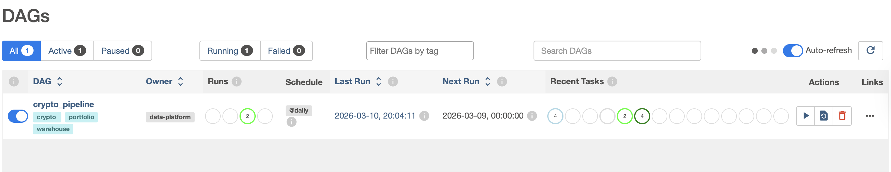
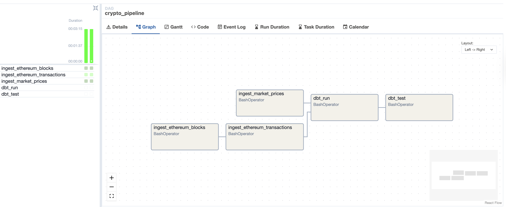

# crypto-data-warehouse

A production-style portfolio project for crypto and on-chain analytics engineering. The repository demonstrates how to ingest blockchain and market data, model it in a warehouse, orchestrate it locally, and expose analytics-ready tables using a clear Bronze to Silver to Gold pattern.

## Why This Project Exists

Many crypto data projects are either toy scripts or very large platforms. This repository is intentionally in the middle: small enough to understand quickly, but structured like a real data platform. It is designed to show hiring managers, founders, and technical reviewers that the core engineering decisions are production-minded.

## Architecture Summary

- Python ingestion services load Ethereum blocks, Ethereum transactions, and daily token prices.
- Postgres stores raw bronze tables for local-first development.
- dbt transforms raw data into Silver normalization models and Gold analytics marts.
- Airflow orchestrates ingestion, dbt runs, and dbt tests.
- Docker Compose runs the local infrastructure.

See [docs/architecture.md](docs/architecture.md) for the full design.

## Stack

- Python 3.11+
- `uv` for dependency management
- Postgres
- dbt Core with `dbt-postgres`
- Airflow
- Docker Compose
- pytest
- Ruff
- pre-commit

## Repository Structure

```text
crypto-data-warehouse/
├── dashboards/
├── dbt/
├── docs/
├── ingestion/
├── orchestration/
├── sql/
├── tests/
├── .env.example
├── .pre-commit-config.yaml
├── docker-compose.yml
├── Makefile
└── pyproject.toml
```

## Data Model Overview

### Bronze

- `bronze_blocks`
- `bronze_transactions`
- `bronze_token_prices`

### Silver

- `silver_blocks`
- `silver_transactions`
- `silver_token_prices`

### Gold

- `gold_daily_active_wallets`
- `gold_transactions_per_day`
- `gold_gas_metrics_daily`
- `gold_token_price_daily`

## Local Development

### Prerequisites

- Python 3.11+
- `uv`
- Docker and Docker Compose

### Setup

1. Copy `.env.example` to `.env`.
2. Run `make install`.
3. Run `make up`.
4. Run `make airflow-init`.

The default local Postgres host port is `5433` to avoid conflicts with an existing local Postgres installation.

### Common Commands

- `make ingest-blocks`
- `make ingest-transactions`
- `make ingest-prices`
- `make dbt-run`
- `make dbt-test`
- `make test`
- `make lint`
- `make format`

## Demo State

The current local demo has already been validated with live data:

- `bronze_blocks`: `2`
- `bronze_transactions`: `467`
- `bronze_token_prices`: `62`
- `gold_daily_active_wallets`: `1`
- `gold_transactions_per_day`: `1`
- `gold_gas_metrics_daily`: `1`
- `gold_token_price_daily`: `62`

See [docs/demo_walkthrough.md](docs/demo_walkthrough.md) for a reviewer-friendly walkthrough and [dashboards/demo_queries.sql](dashboards/demo_queries.sql) for demo SQL.

### Airflow Overview

The orchestration layer is running locally in Airflow and has been exercised against live Ethereum and market data.





## Example Pipeline Flow

1. Fetch a configurable range of confirmed Ethereum blocks via JSON-RPC.
2. Fetch transactions and receipts for those blocks.
3. Fetch daily token price data from CoinGecko.
4. Upsert records into bronze tables in Postgres.
5. Run dbt Silver and Gold models.
6. Run dbt tests for core data quality checks.

The Airflow DAG at [orchestration/airflow/dags/crypto_pipeline.py](orchestration/airflow/dags/crypto_pipeline.py) wires this together for local execution.

## Current MVP Scope

- Ethereum block ingestion
- Ethereum transaction and receipt ingestion
- Daily token price ingestion
- Gold models for active wallets, transaction counts, gas metrics, and price summaries
- Local orchestration and developer tooling

## Future Roadmap

See [docs/roadmap.md](docs/roadmap.md).

## Demo Flow

If you need to show the project quickly:

1. Show `docker compose ps` and Airflow at `http://localhost:8080`
2. Show Bronze row counts in Postgres
3. Show Gold row counts and a few analytics queries
4. Walk through [docs/demo_walkthrough.md](docs/demo_walkthrough.md)

## Sample Outputs

Representative outputs from the current live demo dataset:

### Gold Metric Snapshot

```text
gold_daily_active_wallets = 1
gold_transactions_per_day = 1
gold_gas_metrics_daily = 1
gold_token_price_daily = 62
```

### Token Price Sample

```text
 asset_id | price_date |  close_price   |    market_cap    |  total_volume
----------+------------+----------------+------------------+----------------
 bitcoin  | 2026-03-10 | 69968.64293539 | 1400995283241.75 | 58135886534.80
 ethereum | 2026-03-10 |  2038.72386260 |  246267735988.14 | 25027860656.72
 bitcoin  | 2026-03-09 | 66036.15782363 | 1321622467264.54 | 35845854760.95
 ethereum | 2026-03-09 |  1938.62492535 |  234130530358.19 | 16256963053.69
 bitcoin  | 2026-03-08 | 67271.19077772 | 1345067153653.06 | 24588849466.22
 ethereum | 2026-03-08 |  1969.69379820 |  237705413185.16 |  9708504242.95
```

## What This Demonstrates

- API and RPC ingestion design
- Idempotent warehouse loading patterns
- Analytics engineering with dbt
- Local orchestration with Airflow
- Production-style repo structure and documentation
- Maintainable, reviewer-friendly engineering choices
