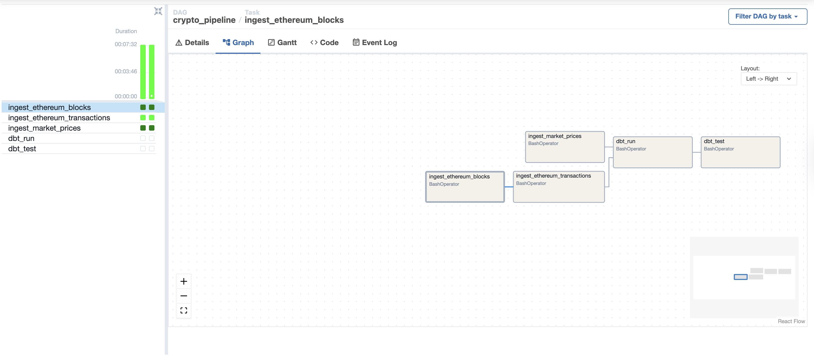
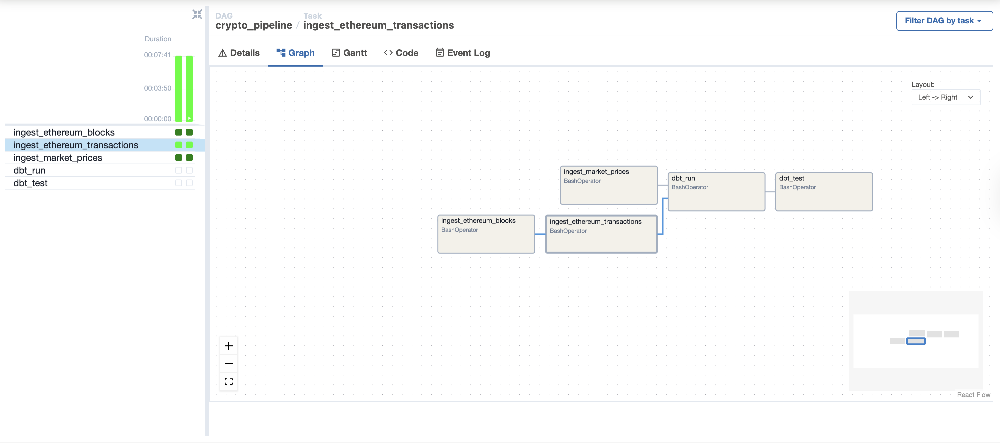

# Demo Walkthrough

This document is the fastest way to show the project in a portfolio or interview setting using the current validated local dataset.

## Current Demo State

The repository has already been validated locally with live data.

Current warehouse state:

- `bronze_blocks`: `2`
- `bronze_transactions`: `467`
- `bronze_token_prices`: `62`
- `gold_daily_active_wallets`: `1`
- `gold_transactions_per_day`: `1`
- `gold_gas_metrics_daily`: `1`
- `gold_token_price_daily`: `62`

This reflects:

- a small Ethereum backfill of two confirmed blocks
- transaction and receipt ingestion for those blocks
- daily market prices for two assets across roughly one month

## What To Show A Reviewer

Use this order:

1. Show the repo structure and README.
2. Show Airflow running locally at `http://localhost:8080`.
3. Show raw Bronze table counts in Postgres.
4. Show Gold table counts and a few query results.
5. Explain the Bronze to Silver to Gold design and why the MVP scope is intentionally narrow.

## Airflow Screenshots

Use these images when presenting the orchestration layer:

### DAG list view

Shows that the `crypto_pipeline` DAG exists, is active, and has recent successful activity.


### Graph view

Shows the dependency chain from ingestion through dbt run and dbt test.


### Task-focused views

These are optional support screenshots if you want to talk through task-level execution.





## Demo Script

### Step 1: Show Running Services

```bash
docker compose ps
```

Call out:

- `postgres` is healthy
- `airflow-webserver` is up
- `airflow-scheduler` is up

### Step 2: Show Raw Table Counts

```bash
docker exec crypto-warehouse-postgres psql -U crypto -d crypto_warehouse -c "select count(*) as bronze_blocks from bronze_blocks;"
docker exec crypto-warehouse-postgres psql -U crypto -d crypto_warehouse -c "select count(*) as bronze_transactions from bronze_transactions;"
docker exec crypto-warehouse-postgres psql -U crypto -d crypto_warehouse -c "select count(*) as bronze_token_prices from bronze_token_prices;"
```

What to say:

- raw blockchain and market data are ingested into Postgres first
- upserts keep loads idempotent
- Bronze retains payload fidelity for future model expansion

### Step 3: Show Gold Table Counts

```bash
docker exec crypto-warehouse-postgres psql -U crypto -d crypto_warehouse -c "select count(*) as gold_daily_active_wallets from analytics_analytics.gold_daily_active_wallets;"
docker exec crypto-warehouse-postgres psql -U crypto -d crypto_warehouse -c "select count(*) as gold_transactions_per_day from analytics_analytics.gold_transactions_per_day;"
docker exec crypto-warehouse-postgres psql -U crypto -d crypto_warehouse -c "select count(*) as gold_gas_metrics_daily from analytics_analytics.gold_gas_metrics_daily;"
docker exec crypto-warehouse-postgres psql -U crypto -d crypto_warehouse -c "select count(*) as gold_token_price_daily from analytics_analytics.gold_token_price_daily;"
```

What to say:

- Gold models are analyst-facing outputs
- the current dataset is intentionally small but fully real
- the design is ready for a larger backfill without changing repo structure

### Step 4: Show Example Analytics Queries

#### Daily active wallets

```bash
docker exec crypto-warehouse-postgres psql -U crypto -d crypto_warehouse -c "select * from analytics_analytics.gold_daily_active_wallets order by activity_date desc limit 5;"
```

#### Transactions per day

```bash
docker exec crypto-warehouse-postgres psql -U crypto -d crypto_warehouse -c "select * from analytics_analytics.gold_transactions_per_day order by transaction_date desc limit 5;"
```

#### Daily gas metrics

```bash
docker exec crypto-warehouse-postgres psql -U crypto -d crypto_warehouse -c "select * from analytics_analytics.gold_gas_metrics_daily order by transaction_date desc limit 5;"
```

#### Token price summary

```bash
docker exec crypto-warehouse-postgres psql -U crypto -d crypto_warehouse -c "select asset_id, price_date, close_price, market_cap, total_volume from analytics_analytics.gold_token_price_daily order by price_date desc, asset_id limit 10;"
```

## Interview Summary

Use this summary if you need to explain the project quickly:

`crypto-data-warehouse` is a local-first crypto analytics platform that ingests Ethereum blocks, Ethereum transactions, and market prices into Postgres, transforms them with dbt into Bronze, Silver, and Gold layers, and orchestrates the full flow with Airflow. The MVP is intentionally narrow, but the repo structure, idempotent load pattern, testing, documentation, and developer experience are set up to scale into a multi-chain warehouse project.

## Why The Current Demo Is Good Enough

Even with a small dataset, the demo already proves:

- external data ingestion works
- raw warehouse loading works
- dbt modeling works
- dbt tests work
- orchestration infrastructure works
- the repository is understandable and runnable by another engineer

For a portfolio review, that is usually more valuable than a huge but fragile backfill.

## If You Want To Strengthen The Demo Later

The next upgrades with the highest portfolio value are:

1. Run a larger Ethereum backfill such as `10` or `25` blocks.
2. Trigger the `crypto_pipeline` DAG manually and capture Airflow screenshots.
3. Add one simple dashboard or notebook over the Gold tables.
4. Add one more domain such as ERC-20 transfers.
